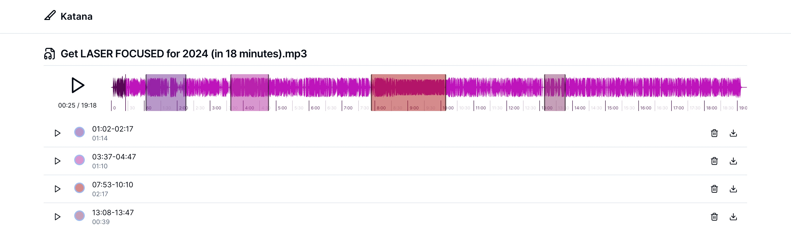

## Katana

Web based audo clip editor. Everything runs in your browser, nothing leaves your browser. WIP.

## Browser support

This should work on desktop Chrome and Firefox.

## Running locally

```bash
npm run dev
# or
yarn dev
# or
pnpm dev
# or
bun dev
```

Open [http://localhost:3000](http://localhost:3000) with your browser to see the result.

## Credits

- [ffmpeg.wasm](https://github.com/ffmpegwasm/ffmpeg.wasm)
- [wavesurfer.js](https://github.com/katspaugh/wavesurfer.js)
- [shadcn/ui](https://github.com/shadcn-ui/ui)

## TODO

- silence detect video: https://dev.to/dak425/automatically-trim-silence-from-video-with-ffmpeg-and-python-2kol
- re: https://gist.github.com/jashmenn/66f2806ae6da643a0bb16452629deee8 